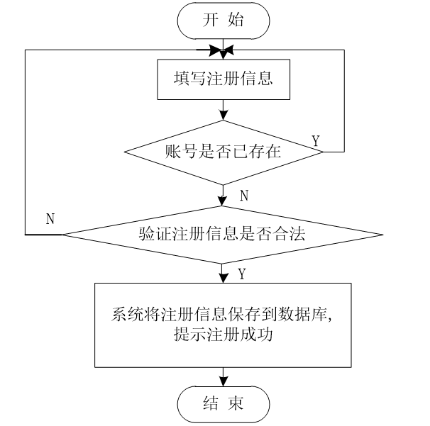
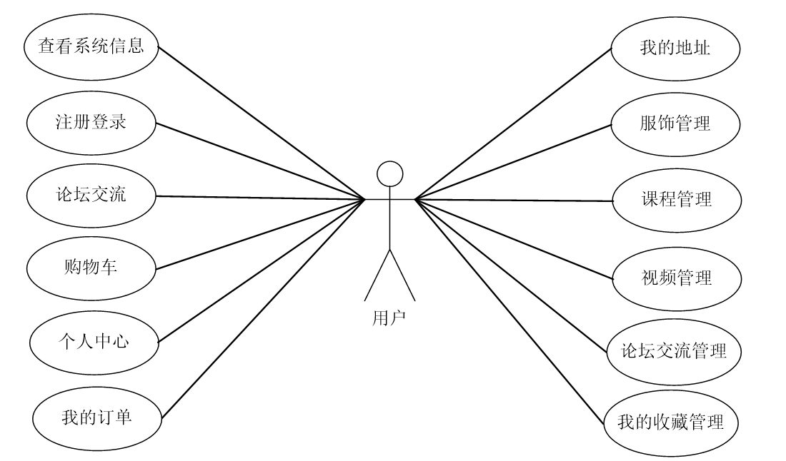
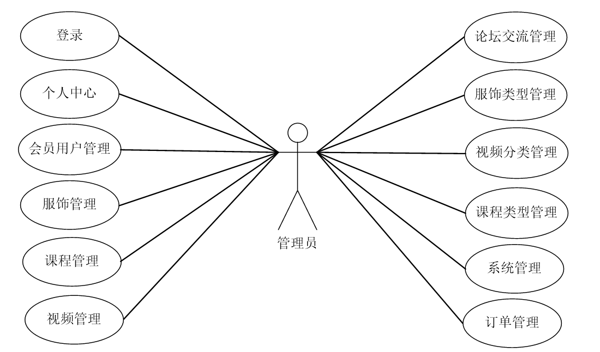
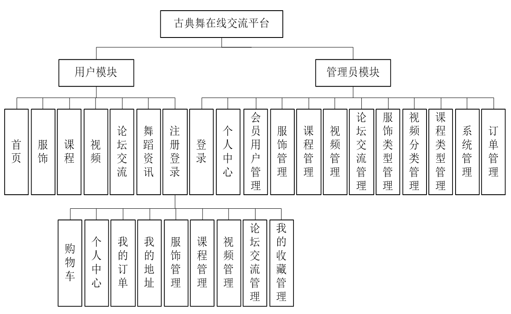
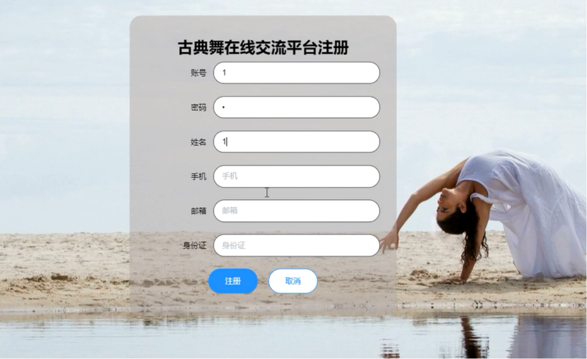
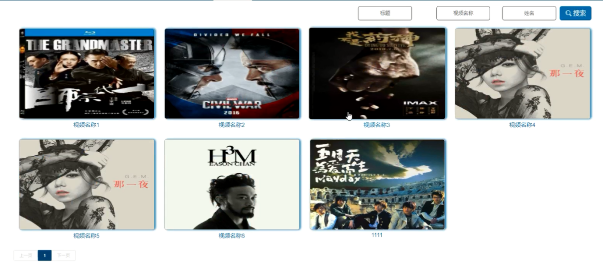
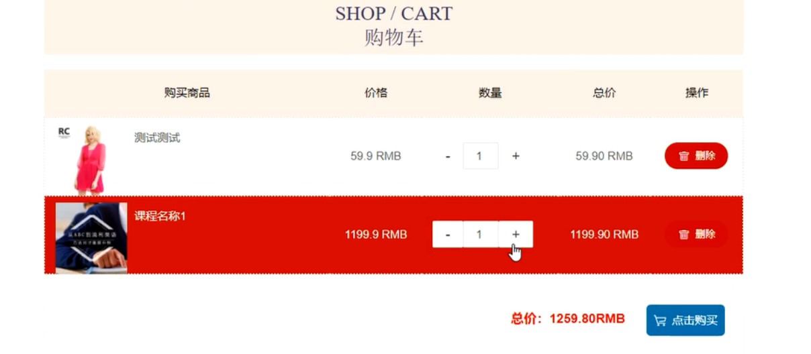
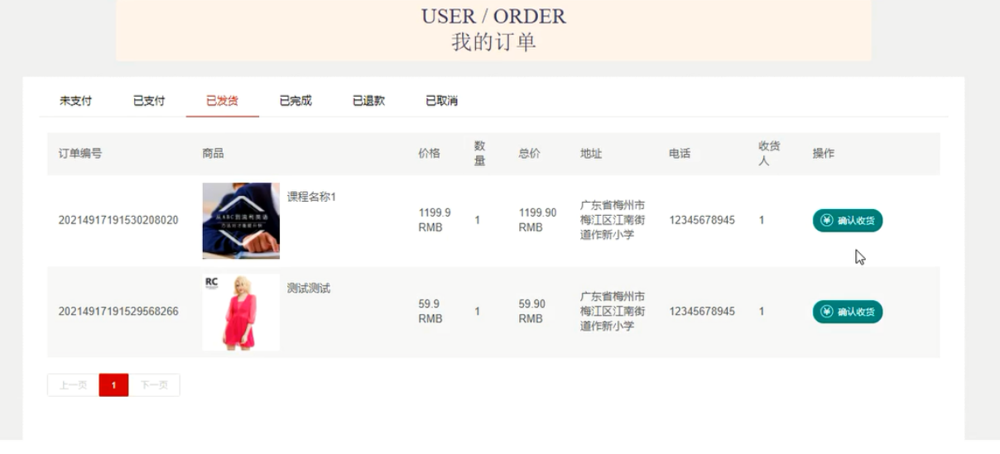
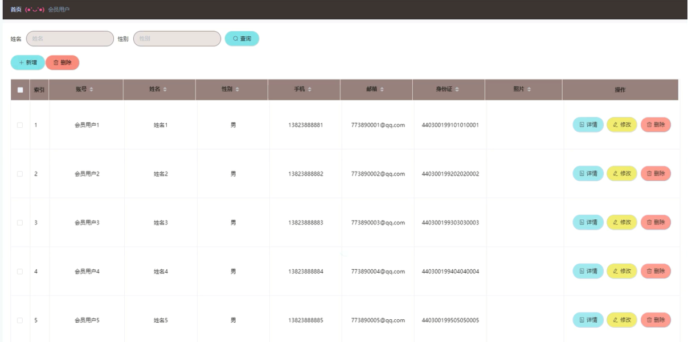
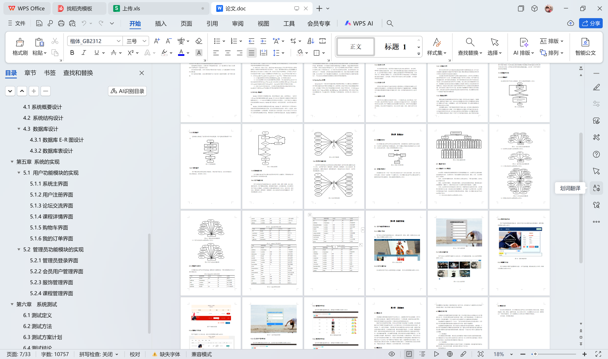

# springboot046-古典舞在线交流平台的设计与实现

>  博主介绍：
>  Hey，我是程序员Chaers，一个专注于计算机领域的程序员
>  十年大厂程序员全栈开发‍ 日常分享项目经验 解决技术难题与技术推荐 承接各类网站设计，小程序开发，毕设等。
>  【计算机专业课程设计，毕业设计项目，Java，微信小程序，安卓APP都可以做，不仅仅是计算机专业，其它专业都可以】

## 3000套系统可挑选，获取链接：https://chaerspol.github.io/

<b>QQ【获取完整源码】：674456564</b>

<b>QQ群【获取完整源码】：1058861570</b>

### 系统架构

> 前端：html | js | css | jquery | vue
>
> 后端：springboot | mybatis
> 
> 环境：jdk1.8+ | mysql | maven

# 一、内容包括
包括有  项目源码+项目论文+数据库源码+答辩ppt+远程调试成功

# 二、运行环境

> jdk版本：1.8 及以上； ide工具：IDEA； 数据库: mysql5.7及以上；编程语言: Java

# 三、需求分析

**3.1 可行性分析**

需要使用大部分精力开发的古典舞在线交流平台为了充分降低开发风险，特意在开发之前进行可行性分析这个验证系统开发是否可行的步骤。本文就会从技术角度，经济角度，还有操作角度等进行综合阐述。

**3.1.1技术可行性**

本文将开发的系统，将采用的关键技术包括JAVA编程语言、B/S架构、MYSQL数据库存储技术等。另外，程序开发需要在自己电脑上安装的软件并不多，在win7操作系统的大环境下，能够完全搭建好程序开发的操作环境，比如开房工具，MYSQL数据库工具，以及处理程序图片的Photoshop工具等都能安装在自己的电脑上。总的说来，开发这个程序在技术上是可以实现的，该项目的开发是有保障的。

**3.1.2经济可行性**

开发这个程序软件并不会涉及到经济上面的开销，在开发软件的选择上也不会额外付费安装软件，在开发软件的官网上面就可以下载需要的软件，并根据提示的安装步骤安装软件到自己的电脑上面。因此，该项目的实施在经济上完全可行。

**3.1.3操作可行性**

操作可行性主要是针对系统用户而言，一个系统再完美，技术再先进，用户不去使用，或者用户根本不会使用，该系统存在的价值也是不大的。本系统拟采用的是B/S架构，用户只要通过点击浏览器即可轻松访问，而用户对浏览器操作非常熟练，所以从用户的角度而言，没有任何学习成本，因此，操作上是可行性的。

**3.1.4时间可行性**

从时间上看，在三个月的时间里学习相关知识，开发本古典舞在线交流平台，时间上是有点紧，但是不是不可能实现，在做毕业设计的这几个月里，我通过努力使得功能应该基本可以实现。
从上面几个部分的可行性分析得出，这次开发的古典舞在线交流平台在开发上面没有什么大问题，值得开发。

**3.2系统性能分析**

**3.2.1 系统安全性**

程序在使用中是不允许其他访问者随意窃取程序里面的隐秘信息，也不允许其他操作者越权操作其他管理用户操作的功能，要真正杜绝这些现象就必须在程序开发之前把程序的安全性给考虑进去。
比如现在很多程序都会把用户注册的功能给考虑进去，让用户在注册页面功能区填写自己的个人信息，这些数据信息涵盖了用户本人的姓名，用户对程序登录设置的密码，用户经常使用的邮箱，用户的常用联系方式还有用户的所住地址等信息，这些信息都是设计到用户本人的隐私，那么这些信息在传输给程序后台时，是需要进行管理并保存至对应的数据库文件里面。要是有人恶意窃取程序的数据信息，也就会让那些注册了此程序软件的用户的个人隐秘信息都会遭到泄露。这些信息落入其他不法分子手里，他们极有可能根据用户的隐私信息去骚扰用户，并把这些信息用于各种商业用途谋取其他非法的利益。所以数据安全性是一个系统能不能使用的首要标准。

**3.2.2 数据完整性**

数据完整性是确保数据信息是否具有可靠性，是否具有参考价值的一个重要因素，数据信息只描述一部分，或者必有的数据信息反而为空等现象都是代表着这个数据信息不完整，有数据缺陷，这是个很严肃的问题，因为这样的数据信息跟垃圾信息没什么两样。
说到数据完整性，不得不提最常用的程序表单功能。这些表单主要就是提取广大用户的数据信息的，需要广大用户根据表单上的要求，填写自己的姓名信息，以及自己的联系方式信息，有些也会有额外的信息填写要求，有必须要填的选项，也有不需要必填的选项。假如广大用户为了保护自己的隐私，或者不想受到其他人的骚扰，不填写必填项等信息，广大用户在最后提交此表单的时候，往往都是提交不了的。
由于数据表之间也会存在一定的联系，所以同一个数据也会出现在另一个表格里面，那么这两个表格记录的同一个数据应该是一样的。不能够是同样的数据信息在不同表中不一样。

**3.2.3系统可扩展性**

一切事物都是一直在发展，程序员开发软件也需要带着发展的思维去进行软件开发操作，这样的话，开发出来的程序在应对管理所需时，也会相对应的进行程序升级与更新。不论是功能完善还是数据库升级都能在原来的基础上对原有程序进行迭代升级。让开发出来的程序能够走得越来越远。这也是广大用户对程序软件的使用要求。

**3.3系统流程分析**

未有账号的用户可进行注册操作，用户注册流程图如图所示。

**3.4用户功能分析**

用户在系统前台可查看系统信息，包括首页、服务、课程、视频、论坛交流、舞蹈资讯等，用户要想实现发帖、服饰购买等操作，必须登录系统，没有账号的用户可进行注册操作，注册登录后主要功能模块包括个人中心、我的订单、我的地址、服饰管理、课程管理、视频管理、论坛交流管理以及我的收藏管理。用户用例图如所示。

**3.5管理员功能分析**

管理员可登录系统后台对系统进行全面管理操作，管理员主要功能模块包括个人中心、会员用户管理、服饰管理、课程管理、视频管理、论坛交流管理、服务类型管理、视频分类管理、课程类型管理、系统管理以及订单管理。 管理员用例图如图所示。

# 四、功能模块

系统整体设计是一个将一个庞大的任务细分为多个小的任务的过程，这些小的任务分段完成后，组合在一起形成一个完整的任务。本古典舞在线交流平台主要包括用户功能模块和管理员功能模块，系统功能模块图如图所示。

# 五、部分效果图展示

图5.1系统主界面【用户进入本系统可查看系统信息，主要包括首页，服饰，课程，视频以及论坛交流等，系统主界面展示如图】

图5.2  用户注册界面【没有账号的用户可进入注册界面进行注册操作，用户注册界面展示如图】

图5.3 论坛交流界面【用户在论坛交流界面可查看已有交流信息，并可选择查看详情，论坛交流界面展示如图】

图5.4  课程详情界面【用户可选择课程查看详情信息，登录后可进行加入购物车或者购买操作，课程详情界面展示如图】

图5.5 购物车界面【用户在购物车界面可查看购物车商品，并可修改数量、删除或者提交订单等，购物车界面展示如图】

图5.6 我的订单界面【用户可查看个人订单信息，我的订单界面展示如图】

图5.7  管理员登录界面【管理员要想进入系统后台对系统进行管理操作，必须登录系统后台，管理员登录界面展示如图】

图5.8  会员用户管理界面【管理员可增删改查会员用户信息，会员用户管理界面展示如图】

 <b>完整文章</b>
 

 

## 3000套系统可挑选，获取链接：https://chaerspol.github.io/

<b>QQ【获取完整源码】：674456564</b>

<b>QQ群【获取完整源码】：1058861570</b>

